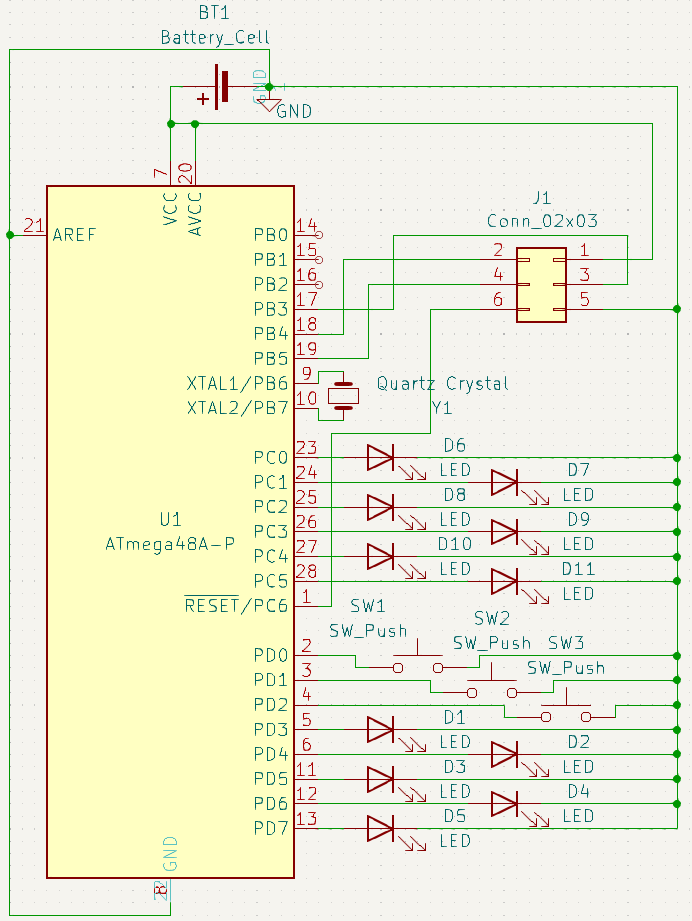
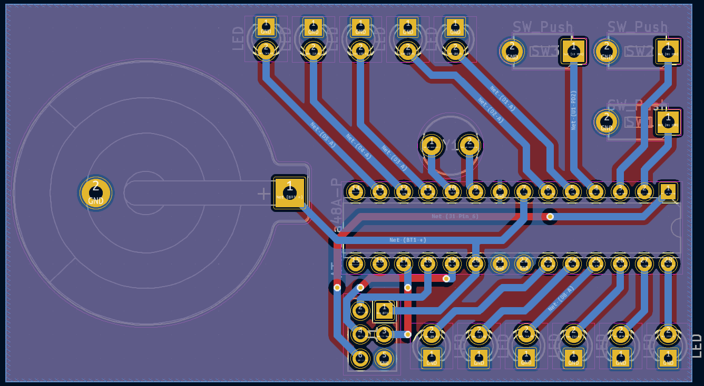

# 0bCLK
11 LED Binary Clock using an ATmega48A, [Datasheet](ATmega48A-PA-88A-PA-168A-PA-328-P-DS-DS40002061A.pdf)

## FEATURES:
 - Binary Time on 11 LED's with PWM brightnesscontrol
 - Control over buttons
 - Sleepmode with shown reduce of power
 - Timebase using Timer and quartz crystal (accuracy can be messured at PB0)
 - Flashing using ISP, for example using a USBasp and avrdude or an Arduino


## Schematic:


## PCB:
 - I used a mill for the 2-layer PCB
 - All components are mounted on the top and soldered on the bottom
 - I used CR2032 battery cells
 - For orientation of the ISP: 
   - the square pad on the footprint is the VCC pin of the 6-pin ISP



## Command for flashing using avrdude in Windows: 
```avrdude -c [programmer] -p m48A -Uflash:w:Path\To\CLK\Debug\CLK.hex:i```

Example using USBasp, path is "C:\Atmel_Studio\7.0\CLK\Debug\CLK.hex":

```avrdude -c usbasp -p m48A -Uflash:w:C:\Atmel_Studio\7.0\CLK\Debug\CLK.hex:i```

## Power saving:
 - If CPU is doing nothing (waiting for Timer interrupt) 
   - goes to PWR_SAVE (basically completely off exept async Timer and interrupt)
 - Disabling individual Timers, Two Wire Interface (TWI), Universal Synchronous Asynchronous Receiver Transmitter (USART0) and Analog Digital Converter (ADC)
 - more optimizations: turning off Watchdog timer, brown out, lower CPU CLK, lower voltage, using sleepmodes

## Fuse bits:
 - SPIEN: LEAVE ON!
   - else it won't be flashable using SPI/ISP anymore
 - WDTON: OFF 
   - Watchdog timer not needed
 - CKDIV8: OFF
   - no system clock division needed
 - BODLEVEL: Maybe 
   - if left off a brown out might lead to malfunction

## Power usage:
 - Default 6,5mA -> 35h runtime
 - PWR_SAVE 1,2µA -> 191666h ~ 20 years runtime

## CLK inaccuracy:
 - Reasons:
   - No Capacitors at quartz crystal, quartz temperature (25°C is optimal)
 - Messuring:
   - Output of Pulse Per Second (PPS) Signal at PB0 and meassuring using a counter

## Timers:
 - Timer 0: every ms for PWM
 - Timer 2: every second for timebase

## Buttons:
 - PD0 -> down (PCINT16/RXD)
 - PD1 -> up (PCINT17/TXD)
 - PD2 -> mode (PCINT18/INT0)

## Ports: 
 - Data Direction Register:
   - DDR=0: Pin is input (button)
   - DDR=1: Pin is output (LED)
 - PORT-Register: 
   - if DDR=0 
     - 1: Pull-up resistor is active, for button
     - 0: Pull-up not active
   - if DDR=1 
     - 1: High voltage output
     - 0: Low voltage output
